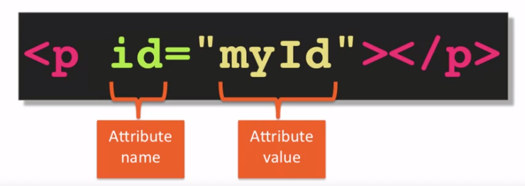
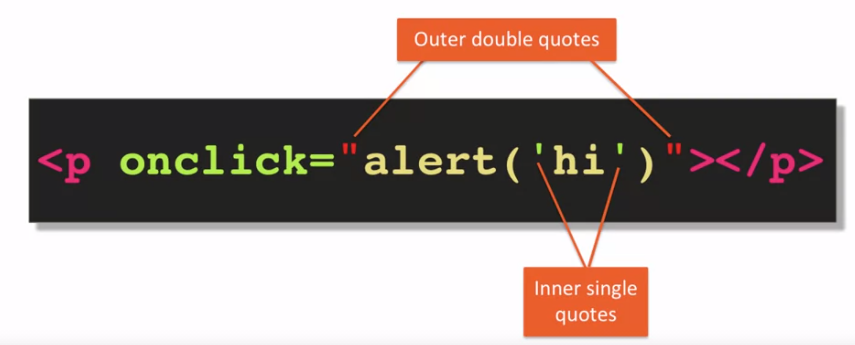

# Development Environment Setup, Part 3: Github and Browser Sync

**Comandos git**
```js

browser-sync start --server --directory --files "*"

```
# Resources for asking questions 
Para encontrar problemas o preguntar : `stackoverflow.com `
`jsfiddle.net` es un recurso para copiar código y pedir ayuda 
`codepen.io` desarrollador remoto, posee una consola  
`Css-tricks.com`recurso y tutoriales acerca html and CSS 

# What is HTML( HyperText Markup Language)

1. **Hypertext**: es un documento que apunta a otros documentos 
2. **Markup** 
3. **Language** 

**HTML** es la estructura, **CSS** es el esilo, es decir, color, fuente y finalmente tenemos **JavaScript** el cual se encarga de dar funcionalidad 


`Caniuse.com` investigación de características que permite saber si una característica en particular se implementa o no en una versión particular de un navegador 

# Anatomy of an HTML Tag+

```js
<p> Opening tag
</p> Closing tag
<br> Line break
<hr> Horizontal rule 
// Etiqueda de cierre automático
<p/>
<p></p>
```
El atributo es un par de valores de nombre que es una especie de metadatos sobre el elemento mismo



# HTML content models
1. Block- Level Elements
2. Inline Elements

## **Semantic html element** :
Es un elememento que te dice algo sobre le contenido 

```html
<!doctype html>
<html>
<head>
  <meta charset="utf-8">
  <title>Heading Elements</title>
</head>
<body>
  <header>
    header element - Some header information goes here. Usually consists of company logo, some tag line, etc. Sometimes, navigation is contained in the header as well.
    <nav>nav (short for navigation) element - Usually contains links to different parts of the web site.</nav>
  </header>
  <h1>Main Heading of the Page (hard not to have it)</h1>
  <section>
    Section 1
    <article>Article 1</article>
    <article>Article 2</article>
    <article>Article 3</article>
  </section>
  <section>
    Section 2
    <article>Article 4</article>
    <article>Article 5</article>
    <article>Article 6</article>
    <div>Regular DIV element</div>
  </section>
  <aside>
    ASIDE - Some information that relates to the main topic, i.e., related posts.
  </aside>

  <footer>
    JHU Copyright 2015
  </footer>
</body>
</html>
```
## Lists 
Son utiles para agrupar contenido 
```js
<!DOCTYPE html>
<html>
<head>
  <meta charset="utf-8">
  <title>Unordered Lists</title>
</head>
<body>
  <h1>Unordered list</h1>
  <div>
    
    My typical dinner shopping list:
    <ul>
      <li>Milk</li>
      <li>Donuts</li>
      <li>Cookies
        <ul>
          <li>Chocolate</li>
          <li>Sugar</li>
          <li>Peanut Butter</li>
        </ul>
      </li>
      <li>Pepto Bismol</li>
    </ul>


  </div>
</body>
</html>
```

```html 
  &nhsp; No romper espacio, ni eliminar todos los espacios entre las palabras 
```